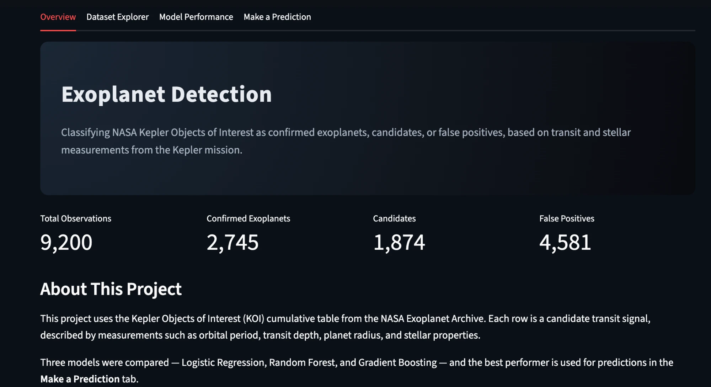
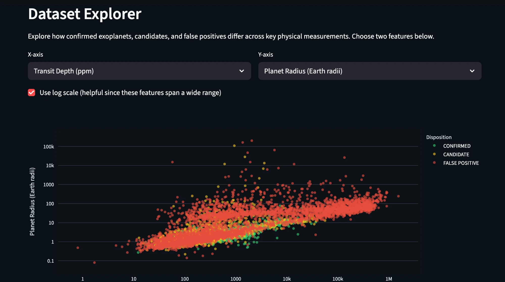
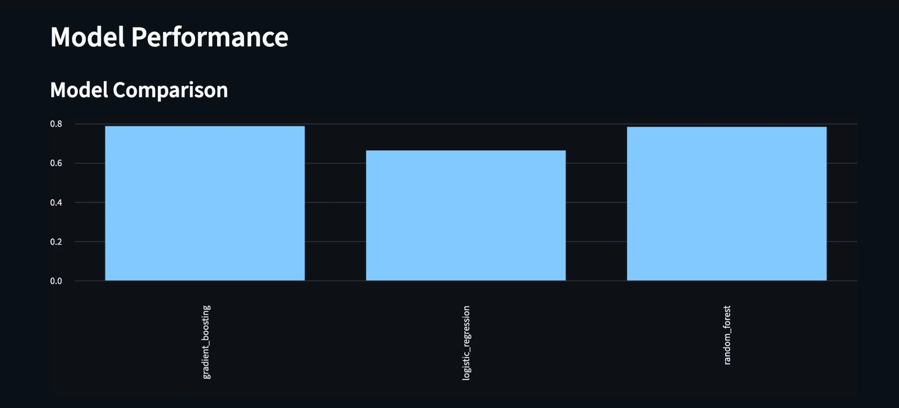
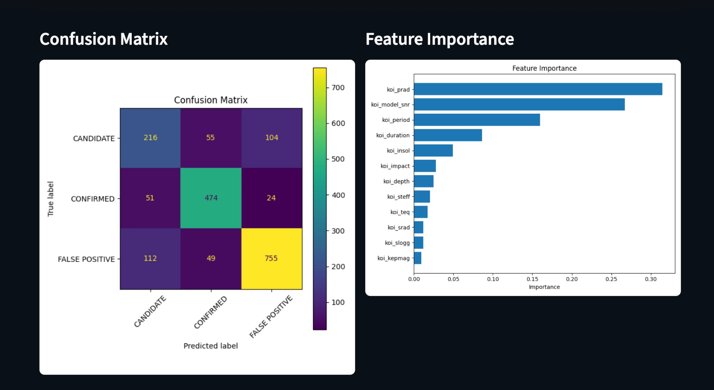
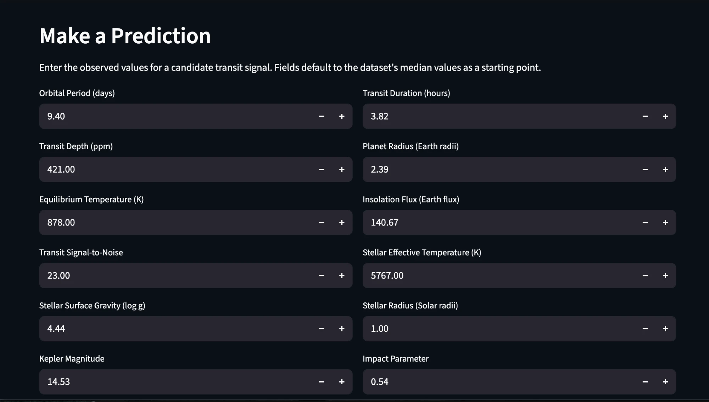
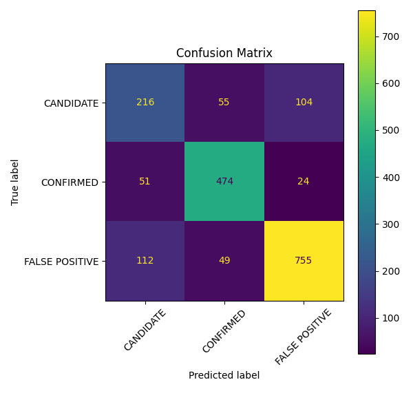
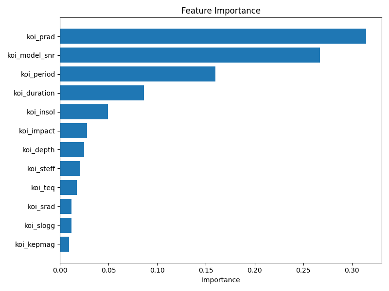

# Exoplanet Detection

An end-to-end machine learning project that predicts whether an astronomical
observation is likely to be a confirmed exoplanet, using public data from
NASA's Kepler mission.

## Live Demo

[exoplanet-detection-w5bx.onrender.com](https://exoplanet-detection-w5bx.onrender.com)

Hosted on Render's free tier — if the app has been idle for a while, the
first load may take 30-60 seconds while the instance spins back up.

### Screenshots

**Overview**


**Dataset Explorer**


**Model Performance**



**Make a Prediction**


## Project Goal

Given measurements collected about a candidate transit signal (orbital
period, transit depth, stellar properties, etc.), predict whether the
observation represents a confirmed exoplanet, a candidate, or a false
positive.

## Dataset

This project uses the **Kepler Objects of Interest (KOI) cumulative table**
from the [NASA Exoplanet Archive](https://exoplanetarchive.ipac.caltech.edu/).

It was chosen because it is:
- an official, well-documented NASA dataset
- moderately sized and easy to work with
- structured with a clear classification target (`CONFIRMED`, `CANDIDATE`,
  `FALSE POSITIVE`) already provided by domain experts

## Installation

`requirements.txt` covers only what's needed to run the Streamlit dashboard.
For everything else (downloading data, training, the API, notebooks, tests),
use `requirements-dev.txt` instead, which includes `requirements.txt` plus
development tools.

```bash
python3 -m venv .venv
source .venv/bin/activate
pip install -r requirements-dev.txt
```

## Usage

Download the dataset:

```bash
python3 src/download_data.py
```

This saves the KOI cumulative table to `data/raw/koi_cumulative.csv`
(not committed to the repo — download it fresh instead).

Clean the data and train the model:

```bash
python3 src/preprocess.py
python3 -m src.train
```

This produces `data/processed/koi_clean.csv` and `data/processed/model.pkl`,
both required by the API and dashboard below.

Run the Streamlit dashboard:

```bash
streamlit run app/dashboard.py
```

Run the prediction API:

```bash
uvicorn api.main:app --reload
```

### Running with Docker

Make sure you've already run the download, preprocessing, and training
scripts locally at least once (Docker mounts `data/` from the host rather
than retraining inside the container):

```bash
docker compose up --build
```

This starts the API at `http://localhost:8000` and the dashboard at
`http://localhost:8501`.

## Model Comparison

Three models were trained on the same 12 core physical features and
compared on a held-out 20% test set:

| Model | Accuracy | Notes |
|---|---|---|
| Logistic Regression | 66.1% | Simple, interpretable baseline |
| Random Forest | 78.2% | Handles non-linear feature interactions, robust to outliers |
| **Gradient Boosting** | **78.5%** | Best overall; selected as the final model |

Gradient Boosting was chosen because it had the highest test accuracy and,
importantly, the best recall on the hardest class (`CANDIDATE`).

## Results

The final Gradient Boosting model reaches **78.5% accuracy** on the test
set. Performance varies noticeably by class:

| Class | Precision | Recall | F1-score |
|---|---|---|---|
| CANDIDATE | 0.57 | 0.58 | 0.57 |
| CONFIRMED | 0.82 | 0.86 | 0.84 |
| FALSE POSITIVE | 0.86 | 0.82 | 0.84 |

The model is noticeably weaker at identifying `CANDIDATE` observations than
the other two classes. This makes sense: candidates are, by definition, the
ambiguous cases that haven't yet been confirmed or ruled out, so they sit
between the other two classes rather than having a distinct signature.

### Confusion Matrix



### Feature Importance



The two most influential features are `koi_prad` (planet radius) and
`koi_model_snr` (transit signal-to-noise ratio) — consistent with the
physical intuition that a plausible planet size combined with a clean,
strong transit signal is what most reliably distinguishes real exoplanets
from noise and false positives.

## Future Improvements

- Tune hyperparameters (e.g. grid search over Gradient Boosting's learning
  rate and tree depth) rather than using scikit-learn's defaults
- Try imputing missing values instead of dropping incomplete rows, to see
  whether the extra ~3.8% of retained data improves `CANDIDATE` recall
- Add cross-validation instead of a single train/test split for more
  robust accuracy estimates
- Experiment with additional KOI columns beyond the 12 core features used
  here, now that leakage-prone columns have been identified and excluded
